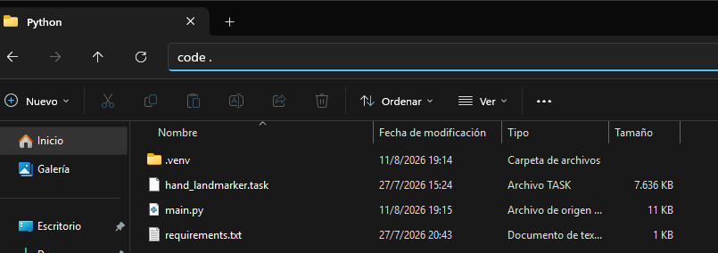
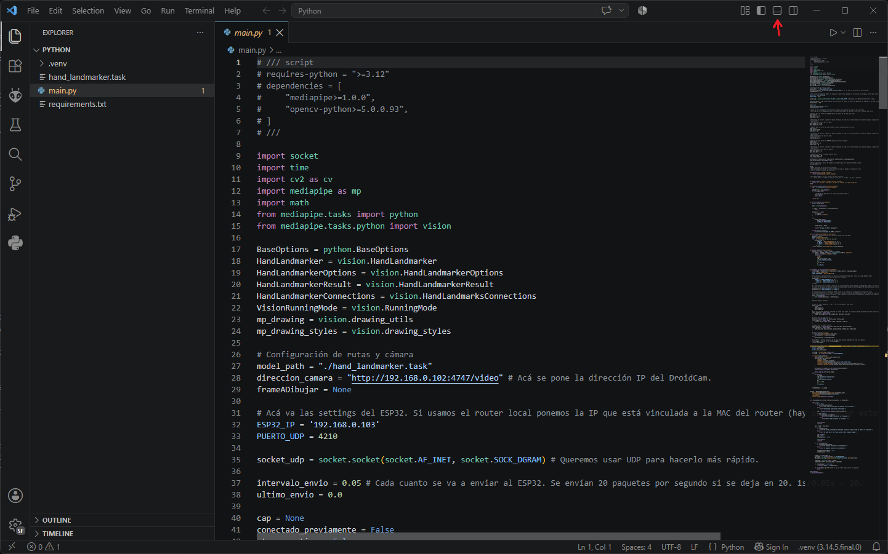
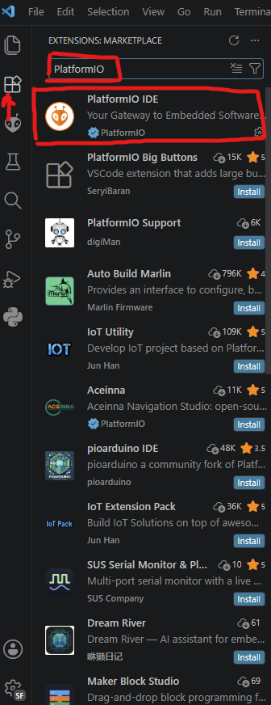
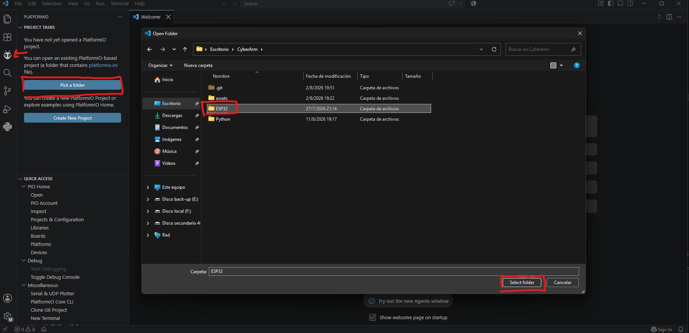
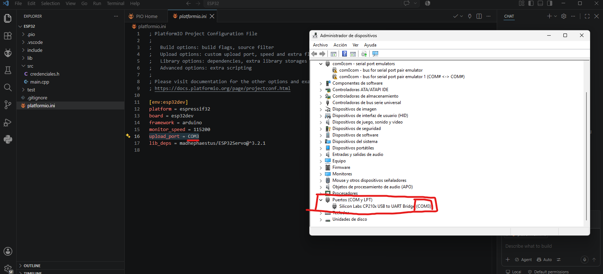
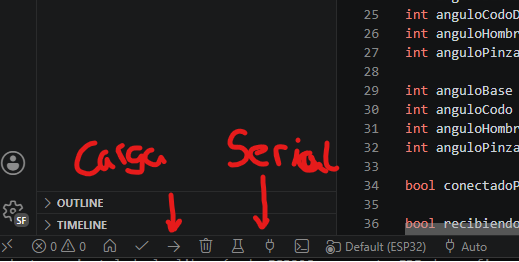
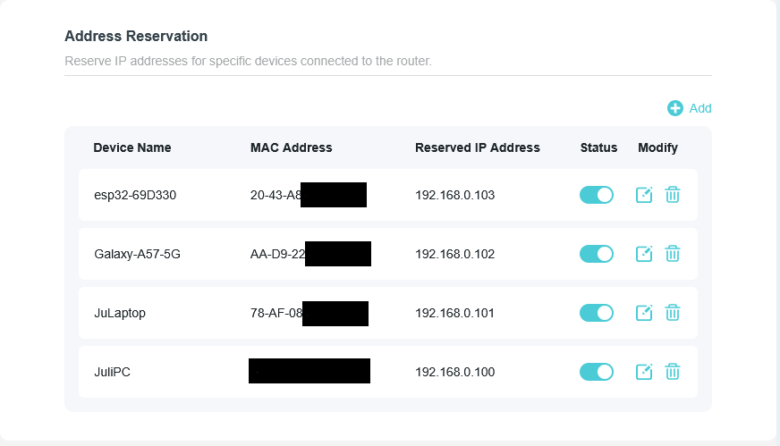

# CyberArm

### Como preparar el proyecto

1. Descargate VSCode (https://code.visualstudio.com/download?_exp_download=fb315fc982).
2. Descargar DroidCam a través de la Play Store o la App Store

## Python

1. Instalar UV. Para hacer esto abrí PowerShell y ejecutá el siguiente comando: ```powershell -ExecutionPolicy ByPass -c "irm https://astral.sh/uv/install.ps1 | iex"```
2. Bajarse el modelo de Google para detectar los puntos de la mano y colocarlo en la carpeta de Python: https://storage.googleapis.com/mediapipe-models/hand_landmarker/hand_landmarker/float16/latest/hand_landmarker.task
3. Dentro de la carpeta "Python" en la barra de ruta escribe ```code .``` y dale click al enter. Esto te abrirá la carpeta de Python en VSCode.

4. Coloca la dirección IP de la cámara en ```direccion_camara``` y la IP del ESP32 en ```ESP32_IP```.
5. Abre la consola dentro de VSCode. 

6. Ejecuta ```uv run .\main.py```

## ESP32
1. Instalá los drivers del ESP32 https://www.youtube.com/watch?v=a2yP7YGnQ_c
2. Conectá el ESP32 al computador a través de USB.
3. Abre una ventana de VSCode e instalá PlatformIO.

3. Dale click al ícono de la extensión que se formó a la derecha y abrí la carpeta de ESP32.

4. En la carpeta "src" se va a encontrar el archivo ```credenciales.h```. Acá colocá el nombre de la red WiFi en ```ssid``` y la contraseña en ```password```
5. En ```main.cpp``` colocá los pines de los servos en la función setup y colocá los valores por defectos de los ángulos de los servos
6. Abrí el Administrador de dispositivos de Windows.
7. Una vez tengas cargado eso, andá a ```platformio.ini``` y colocá el puerto del USB donde tengas enchufado el ESP32.

8. Cargá el código al ESP32 y si querés abrí la consola serial para monitorear lo que le llegue por puerto serial.


## Router

Cuando hayas conectado los 3 dispositivos a la red busca la MAC que tiene cada uno de ellos. La mayoría de routers permiten ver la dirección MAC de los dispositivos conectados a la red. Una vez tengas la MAC de cada uno de los dispositivos resérvales a cada uno una IP en el DHCP asociándola con la MAC.

